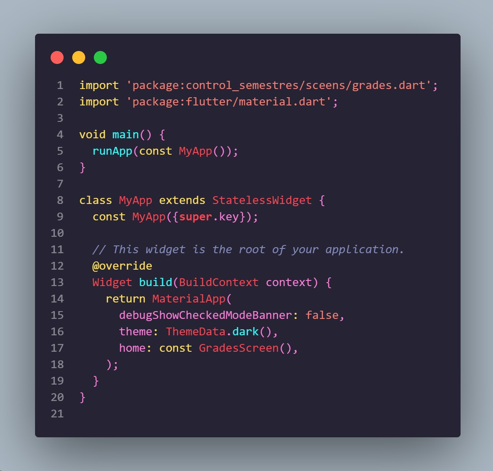
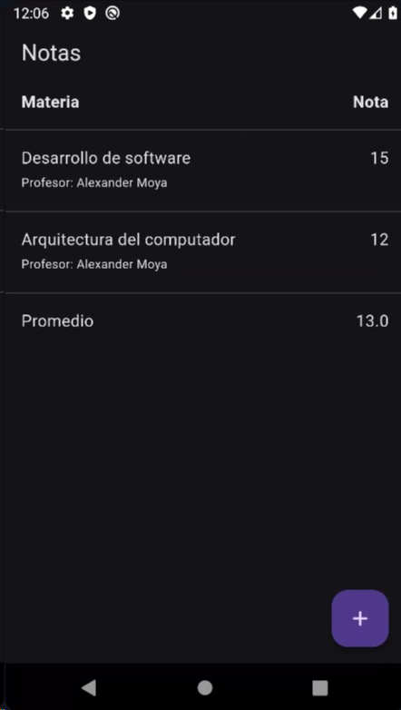
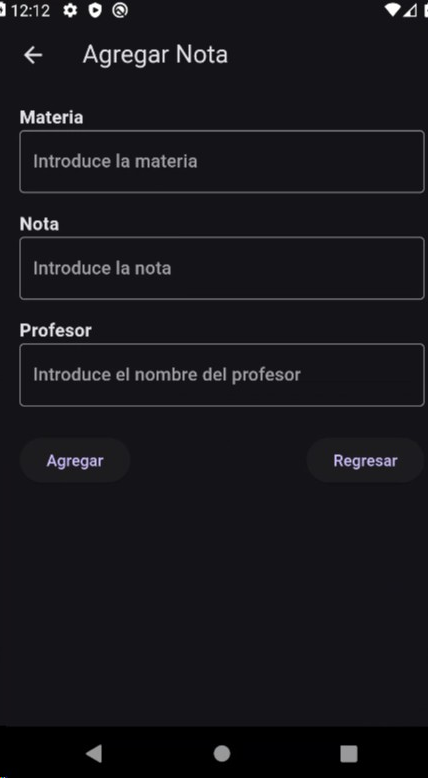
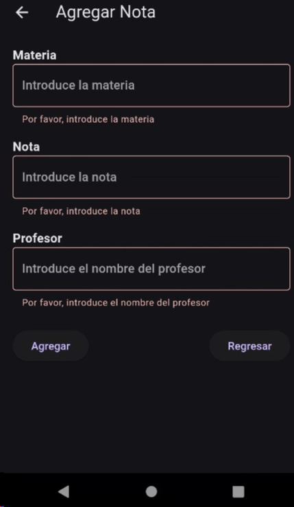
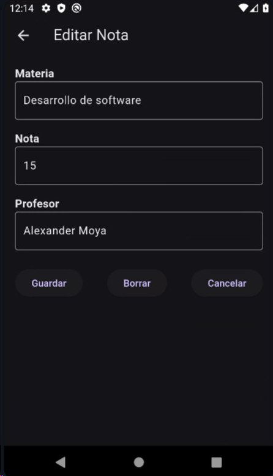
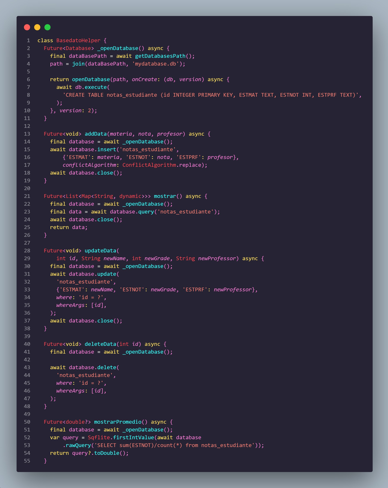
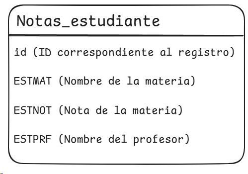
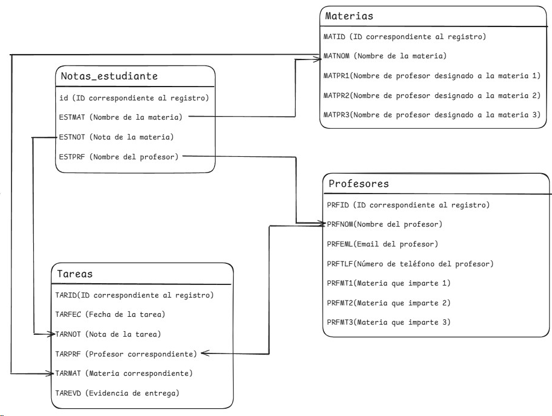

# control_semestres

Esta aplicación se desarrollo con la intención de llevar el control de las materias que se lleva durante el semestre, siendo capaz de agreagr, modificar y eliminar estos mismos.

Las herramientas utilizadas son:
- Dart (Lenguaje de programación)
- Flutter (Framework)
- SQLite (Base de datos)

---

## Primera versión
Este proyecto inició como un proyecto personal para poder tener un registro de las materias inscritas y las tareas realizadas durante el semestre. La primera versión se enfocó en establecer las principales pantallas y la clase para la manipulación de base de datos.

### Main

El archivo main establece el tema oscuro (En esta versión no se puede cambair el tema) y lleva a la pantalla principal.

Esta versión consta de 3 pantallas, todas haciendo uso de un archivo que proporciona todos los métodos necesarios para el uso de la base datos. El archivo principal que lleva el nombre GradesScreen se encarga de mostrar las materias con las notas y profesor mediante una lista que también posee un encabezado y una línea final que muestra el promedio. Esta lista se forma con una función asíncrona donde se determina la respuesta de la base de datos para mostrar si está cargando, hubo un error, no hay datos o si construye la lista con los datos que recibió.

- Pantalla principal

  1. Pantalla principal sin datos

  

  2. Pantalla principal con datos

  

Las otras dos pantallas constan de los formularios para añadir un nuevo dato (accesible al presionar el botón abajo a la derecha) y para modificar/eliminar un dato (accesible al toque cualquiera de los datos listados en la pantalla principal). Estos dos poseen un código muy similar donde se tienen tres inputs, uno para la materia, otro para la nota y otra para el profesor, donde se evalúa si no se intenta agregar datos vacíos. Abajo se encuentran los botones de agregar y regresar o los botones de modificar, eliminar y regresar en el caso de encontrarse en la pantalla de modificación de datos.

- Pantalla agregar nota

    1. Pantalla para agregar datos

    

    2. Pantalla para agregar datos - en caso de poseer inputs vacíos

    
    

La pantalla de modificar datos se accede al presionar alguna de las materias de la pantalla principal. Este te lleva a una pantalla identica a la de agregar datos, solo que mostrando los datos que ya se habían cargado en la base de datos mediante una consulta usando el ID del registro seleccionado.

- Pantalla editar nota

### Basedato_helper
Este archivo tiene la clase que contiene los métodos para todas las operaciones que se realiza con la base de datos. En esta primera versión solo se usa una tabla, así que este archivo solo contiene las operaciones para iniciar la base de datos, insertar datos, eliminar datos, mostrar datos y calcular el promedio.
Cabe mencionar que, en este proyecto se usa una base de datos interna, así que es el propio dispositvo el que almacena esta y si se elimina la aplicación también se elimina la información en esta.

Como ya se mencionó, esta versión solo consta de una tabla

Además, se realizó un diagrama de como se esperaba que creciera la base de datos al avanzar el proyecto.
