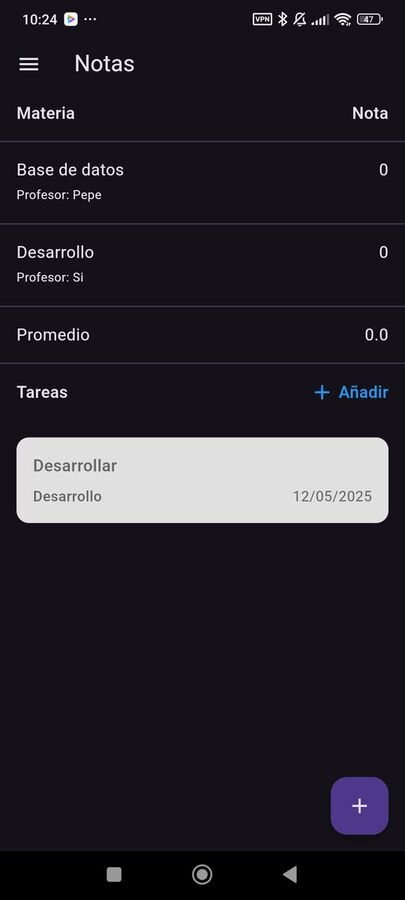
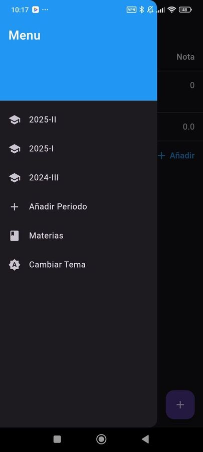
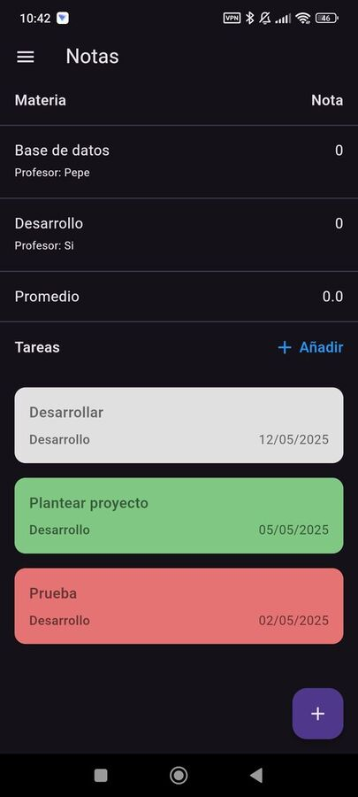
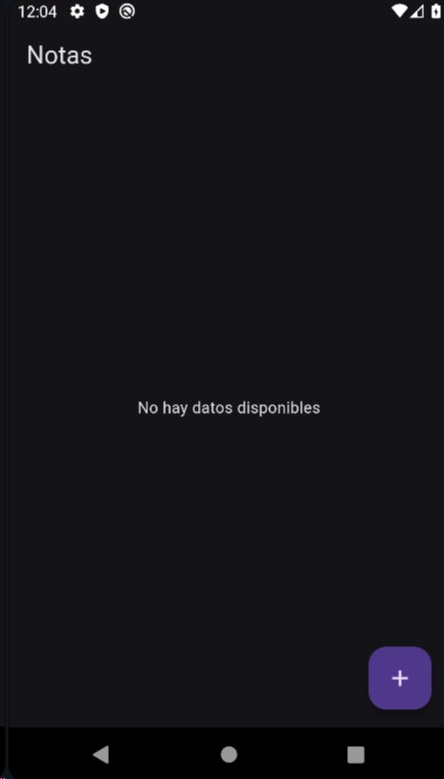

# control_semestres

Esta aplicación se desarrollo con la intención de llevar el control de las materias que se lleva durante el semestre, siendo capaz de agregar, modificar y eliminar estos mismos.

Las herramientas utilizadas son:
- Dart (Lenguaje de programación)
- Flutter (Framework)
- SQLite (Base de datos)

---

## Versión actual
Este proyecto actualmente me ayuda a tener un registro de las materias y tener acceso rápido a información relevante. 
La tercera versión y la actual es la que más cambios conllevó, pues se agregó muchas pantallas y se hicieron modificaciones a como funciona los registros.

Pero antes de empezar, la filosfía de los registros.
Un semestre o cuatrimestre se definen como "períodos academicos". Pueden haber varíos por años (En mi caso son tres cuatrimestres al año). Y cada uno posee sus propias materias.

Diferentes períodos pueden tener "la misma materia". Pues, aunque tengan el mismo nombre, a nivel de base de datos estas se diferencian por el ID.

### Base de datos
Primero, la base de datos.
Se agregarón nuevos campos a la tabla de materias y se agregó una nueva tabla el cual se encarga de guardar los períodos. Solo puede existir un periodo activo a la vez.

Los campos de la tabla tiene esa nomenclatura donde las tres primeras letras representa la tabla y los otros tres el campo en sí, porque así se maneja en mi trabajo y así plantee los nombres cuando empecé el proyectos (cosas de trabajar con AS400).

### Pantalla principal
La pantalla principal muestra todas las materias a través de una consulta de la base de datos, se puede añadir materias presionando el boton en la esquina inferior derecha. Al final de las materias se encuentra el promedio y despues las tareas.

Hay 3 archivos que son básicamente la misma pantalla, pero con diferentes consultas a la base de datos. El primero, el que accede por defecto, muestra el período marcado como "período actual". El segundo muestra el período seleccionado en el menú lateral. Y el tercero muestra todas las materias.
Es de esta manera, basicamente porque fue la solución que se me ocurrió. Estoy buscando una manera de optimizarlo para no tener que depender en 3 archivos que consta del mismo código.

### Menu lateral
La aplicación posee un menú lateral donde se puede acceder a los períodos creados, crear un nuevo período, acceder a una pantalla con todas las materias sin importar el período y cambiar entre el tema claro y oscuro.

Actualmente solo se puede crear períodos, pero no hay una pantalla donde se pueda modificar o eliminar.

### Materia detallada
Al presionar una de las materias en la pantalla principal te dirige a una pantalla con toda la información de la materia. Al presionar el boton en la esquina inferior derecha te permite modificar los datos.

### Tareas
Las tareas poseen diferentes colores dependiendo del estatus que se le asigna:
- Pendiente: gris
- Finalizada: Verde
- Incompleta: Rojo
Y al presionar uno de estos te permite modificarlo.

---

## Primera versión
Este proyecto inició como un proyecto personal para poder tener un registro de las materias inscritas y las tareas realizadas durante el semestre. La primera versión se enfocó en establecer las principales pantallas y la clase para la manipulación de base de datos.

### Main

El archivo main establece el tema oscuro (En esta versión no se puede cambair el tema) y lleva a la pantalla principal.

Esta versión consta de 3 pantallas, todas haciendo uso de un archivo que proporciona todos los métodos necesarios para el uso de la base datos. El archivo principal que lleva el nombre GradesScreen se encarga de mostrar las materias con las notas y profesor mediante una lista que también posee un encabezado y una línea final que muestra el promedio. Esta lista se forma con una función asíncrona donde se determina la respuesta de la base de datos para mostrar si está cargando, hubo un error, no hay datos o si construye la lista con los datos que recibió.

- Pantalla principal

  1. Pantalla principal sin datos

  

  2. Pantalla principal con datos

  

Las otras dos pantallas constan de los formularios para añadir un nuevo dato (accesible al presionar el botón abajo a la derecha) y para modificar/eliminar un dato (accesible al toque cualquiera de los datos listados en la pantalla principal). Estos dos poseen un código muy similar donde se tienen tres inputs, uno para la materia, otro para la nota y otra para el profesor, donde se evalúa si no se intenta agregar datos vacíos. Abajo se encuentran los botones de agregar y regresar o los botones de modificar, eliminar y regresar en el caso de encontrarse en la pantalla de modificación de datos.

- Pantalla agregar nota

    1. Pantalla para agregar datos

    

    2. Pantalla para agregar datos - en caso de poseer inputs vacíos

    

La pantalla de modificar datos se accede al presionar alguna de las materias de la pantalla principal. Este te lleva a una pantalla identica a la de agregar datos, solo que mostrando los datos que ya se habían cargado en la base de datos mediante una consulta usando el ID del registro seleccionado.

- Pantalla editar nota

### Basedato_helper
Este archivo tiene la clase que contiene los métodos para todas las operaciones que se realiza con la base de datos. En esta primera versión solo se usa una tabla, así que este archivo solo contiene las operaciones para iniciar la base de datos, insertar datos, eliminar datos, mostrar datos y calcular el promedio.
Cabe mencionar que, en este proyecto se usa una base de datos interna, así que es el propio dispositvo el que almacena esta y si se elimina la aplicación también se elimina la información en esta.

Como ya se mencionó, esta versión solo consta de una tabla

Además, se realizó un diagrama de como se esperaba que creciera la base de datos al avanzar el proyecto.

---

## Segunda versión
En esta versión se enfocó en agregar la sección de tareas y hacer cambios en las pantallas establecidas para añadir información que resulta relevante.

### Tareas
Para empezar el cambio más importante: tareas\
Se modificó la base de datos para agregar las tablas de materias y tareas. Además, se agregó la sección de tareas en la pantalla principal, así que al acceder a esta se realiza una consulta para las materia y otra para las tareas.

Las tareas son mostrados con un color dependiendo del estatus que poseen;
- Pendiente: Gris
- Finalizada: Verde
- Incompleta : Rojo

Estas tareas tienen su propio formulario para agregar nuevos, igual que los anteriores mostrados. Este se accede al presionar el boton "Añadir".

Y al presionar una de las tareas te lleva la pantalla de modificar datos con los datos correspondiente al registro seleccionado.

### Cambios en pantallas materias
Al presionar una de las materias en la pantalla principal te dirige a una pantalla intermedia que muestra más datos de la materia

Y ahora las materias cuentan con su propia tabla, donde el mayor cambio es que la nota se divide en 3 inputs (principalmente, porque así funciona mi universidad) y la nota mostrada en la pantalla principal es la suma de estas tres. A su vez, estos también significó cambios para las pantallas para agregar y modificar las materias.

